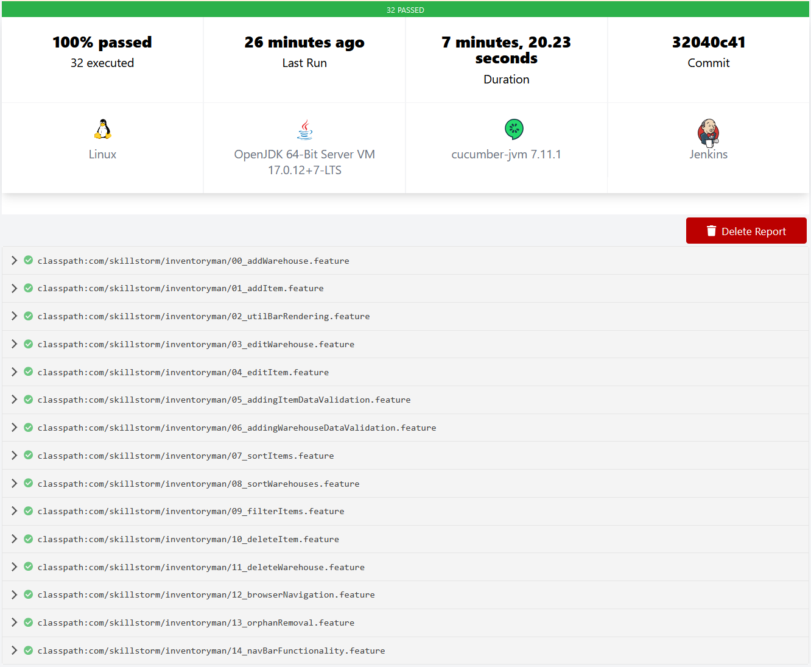
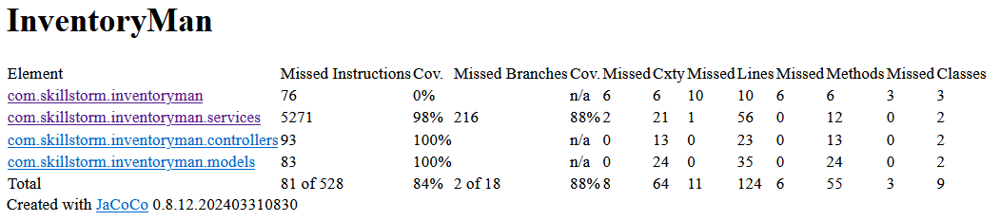
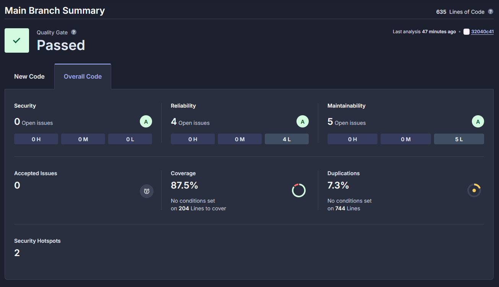
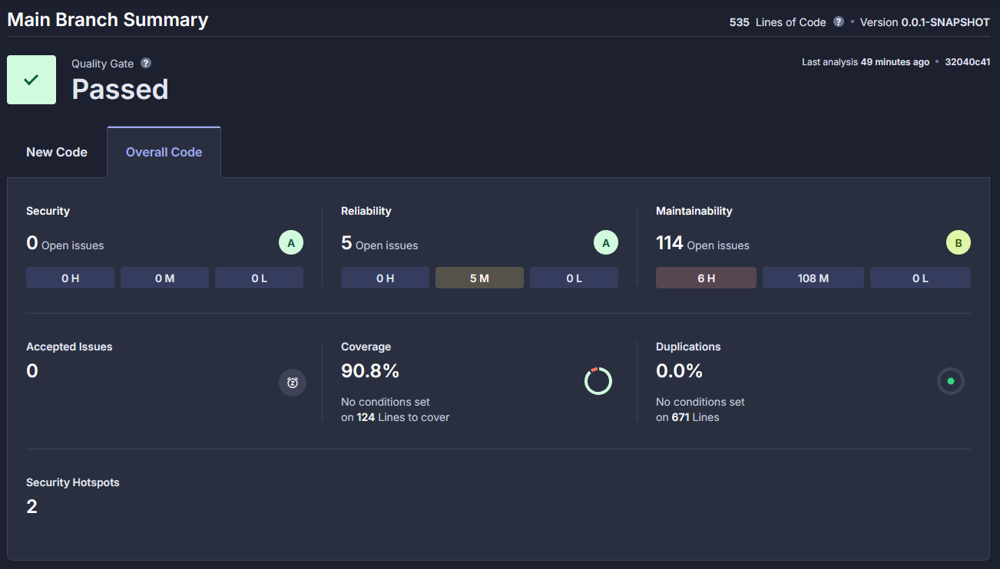
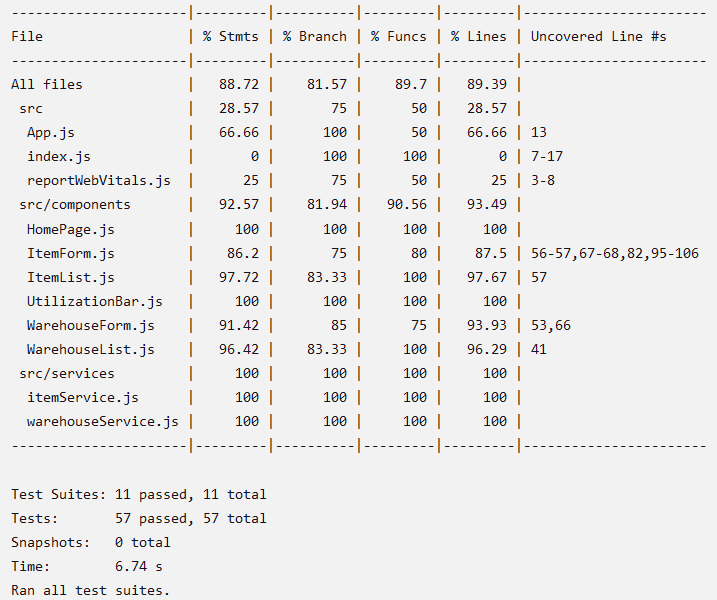
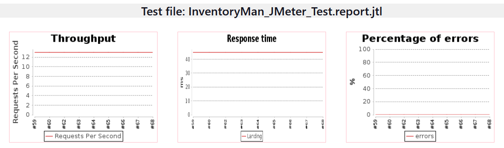
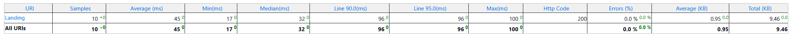

# InventoryMan

### A basic inventory management application created as part of the SkillStorm SDET Apprenticeship

### This project is hosted on AWS! 
Find it [here!](http://inventoryman.s3-website-us-east-1.amazonaws.com/) ([http://inventoryman.s3-website-us-east-1.amazonaws.com/](http://inventoryman.s3-website-us-east-1.amazonaws.com/))

**Update 3/12/25:** InventoryMan has been taken offline from AWS. Thank you for your interest in this demo project!

**Update 9/6/24:** Project 2 content has been added, including additional tests with Mockito, Jest, and more configured in our Jenkinsfile! ***Huge thanks to my groupmate for this project, Bruna Vicente!***

~~**Update 8/26/24:** InventoryMan is back on AWS - this time, using the Aurora RDS, an Elastic Beanstalk backend, and utilizing a separate EC2 instance for Jenkins deployment/Selenium + Cucumber testing.~~

~~**Update 8/5/24:** Project has been taken offline to avoid charges, I apologize for any inconvenience. See the `Resources` section below for a similar implementation!~~

## Test Reports

[Full console output from Jenkins](readme_attachments/im_cicd_output.txt)

*Tests were executed on Jenkins running on an EC2 instance that pulls from this Github repository via a webhook on the main branch.*

### Cucumber Test Results

> **32 tests** were run across **14 feature files**, with **100% passing**.

### Mockito Test Results
> **84% statement coverage**, **88% branch coverage**.

### SonarCloud Test Results

> Frontend has **87% reported code coverage** with A ratings in Security, Reliability, and Maintainability.

> Backend has **90% reported code coverage** with A ratings in Security, Reliability, and a B rating for Maintainability.

*Links to the full reports:*

[SonarCloud InventoryMan Frontend Report](https://sonarcloud.io/summary/overall?id=salmoncore_InventoryMan)

[SonarCloud InventoryMan Backend Report](https://sonarcloud.io/summary/overall?id=salmoncore_inventoryman-backend)

### Jest Test Results

> **88% statement coverage**, with **81% branch coverage**.

### Burp Suite Demo

[Video Recording on Google Drive](https://drive.google.com/file/d/1gKqvzeaNlauKmKzCstGmns3A_ZwsYgZ2/view?usp=sharing)

### JMeter Results

> 10 samples were taken, with an **average response time of 45 milliseconds** and **0% errors**.

## Facts and Features
 - End-to-end testing with Cucumber, Selenium, Jest, Mockito, SonarCloud, and more
 - Full-stack application made with SpringBoot, PostgreSQL, and React
 - CRUD functionality for managing warehouses and inventory
 - Bootstrap UI with card layout for improved readability
 - Sorting and filtering for easy navigation
 - Logic to prevent reaching over-capacity in warehouses
 - Input validation for forms
 - Pre-computed utilization percentage for each warehouse
 - Responsive design for mobile and desktop

## AWS Deployment
 - Amazon Aurora postgres-compatable database hosted on AWS RDS
 - SpringBoot application hosted on Elastic Beanstalk
 - React front-end hosted on AWS S3
 - Jenkins CI/CD pipeline hosted on Amazon EC2

## Running InventoryMan Locally
 - Clone the repository
 - Generate `launch.json` in the `.vscode` folder
   - Database credentials not provided - bring your own!
   - Test database was created with PGAdmin4
 - `application.properties` will also need to be edited to match the location of your DB
 - Run the SpringBoot application via command line or an IDE's SpringBoot runner
 - Run the React front-end using `npm start` from within the `frontend` folder
 - Open your browser of choice and navigate to `localhost:3000`

## Project Structure
 - `backend` contains the SpringBoot application
 - `frontend` contains the React front-end

### Resources I heavily relied on:
 - For getting the initial CRUD functionality set up between the database and backend, this was a great resource: [Spring Boot + React CRUD Example](https://www.bezkoder.com/spring-boot-react-postgresql/)
 - For getting the front-end to communicate with the back-end, this was a great resource: [React Axios Tutorial](https://www.bezkoder.com/react-axios/)
 - I really used a bunch of Bootstrap components, but this was a great resource for getting the cards to look nice: [Bootstrap Card Layout](https://getbootstrap.com/docs/4.0/components/card/) 
   - Bonus for the loading bar I used for a utilization visualization: [Bootstrap Progress Bar](https://getbootstrap.com/docs/4.0/components/progress/)
 - I couldn't have gotten the project up and running on AWS without this guide: [Deploy Full Stack Application (Spring-Boot+MySQL+React) to AWS(EC2, RDS, S3)](https://www.youtube.com/watch?v=YC7NBNICGeY)
 - This was also super helpful for my initial setup on RDS: [Creating an RDS PostgreSQL Database on the AWS Free Tier](https://www.youtube.com/watch?v=I_fTQTsz2nQ)
 - General thanks to all of StackOverflow, all the time, forever.
 - And of course, all of the instruction from Caroline and Erica during the lead-up to this project was invaluable! Thank you both!
